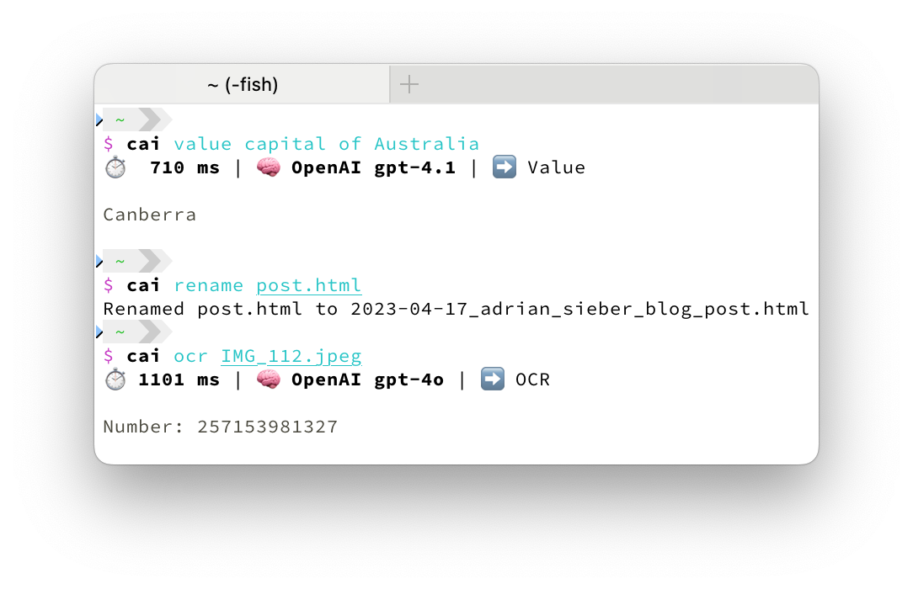
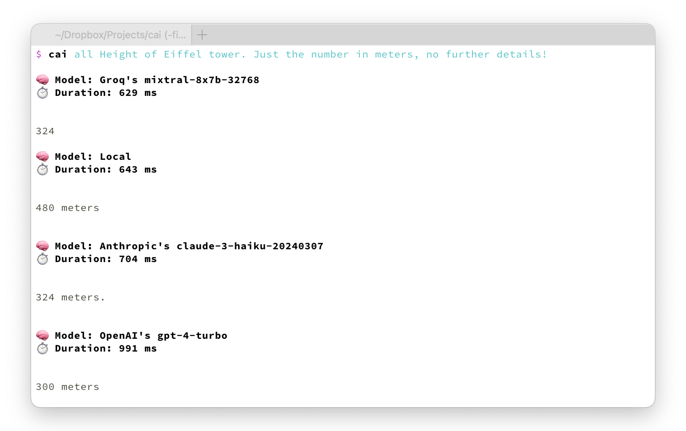

# `cai` - User friendly CLI tool for AI tasks




## Features

- High level commands for great usability
  - `cai value capital of Australia`
  - `cai image photo of a banana` (OpenAI image generation)
  - `cai google-image sunset over mountains` (Google Gemini image generation)
  - `cai ocr page.png`
  - `pbpaste | cai rewrite 'more professional'`
  - Check [usage section](./#usage) for all commands
- Build with Rust 🦀 for supreme performance and speed! 🏎️
- Support for models by
  - [Anthropic]
  - [OpenAI]
  - [Google]
  - [Groq]
  - [Cerebras]
  - [Deepseek]
  - [xAI]
  - Local LLMs via [Ollama] and [Llamafile]
- Prompt several models at once. 🤼
    
- Syntax highlighting for better readability of code snippets. 🌈

[Anthropic]: https://docs.anthropic.com/en/docs/about-claude/models/all-models
[Cerebras]: https://inference-docs.cerebras.ai/introduction
[Deepseek]: https://api-docs.deepseek.com/quick_start/pricing
[Google]: https://ai.google.dev/gemini-api/docs/models
[Groq]: https://console.groq.com/docs/models
[Llamafile]: https://github.com/Mozilla-Ocho/llamafile
[Ollama]: https://ollama.com
[OpenAI]: https://platform.openai.com/docs/models
[xAI]: https://x.ai/api#pricing


## Installation

```sh
$ cargo install cai
```

or install via [Homebrew](https://brew.sh/):

```sh
$ brew install cai
```


## Usage

Before using Cai, an API key must be set up.
Simply execute `cai` in your terminal and follow the instructions.

Cai supports the following APIs:

- **Groq** - [Create new API key](https://console.groq.com/keys).
- **OpenAI** - [Create new API key](https://platform.openai.com/api-keys).
- **Anthropic** -
    [Create new API key](https://console.anthropic.com/settings/keys).
- **Llamafile** - Local [Llamafile] server running at http://localhost:8080.
- **Ollama** - Local [Ollama] server running at http://localhost:11434.

Afterwards, you can use `cai` to run prompts directly from the terminal:

```sh
cai List 10 fast CLI tools
```

Or a specific model, like Anthropic's Claude Opus:

```sh
cai opus list 10 fast CLI tools
```

Full help output:

```txt
$ cai help
Cai 0.12.0

User friendly CLI tool for AI tasks

Usage: cai [OPTIONS] [PROMPT]... [COMMAND]

Commands:
  fast          Shortcut for `groq openai/gpt-oss-20b`
  local         Shortcut for `ollama llama3.2`
  value         Return only the value/answer without explanations
  short         Answer the prompt in a short, compact, and focused manner
  rewrite       Fix spelling, grammar, and wording issues in text passed via standard input
  reply         Reply to a conversation passed via standard input. Add additional reply instructions as the prompt
  image         Generate an image using GPT-image-1.5 [aliases: img]
  say           Convert text to speech using OpenAI's TTS model [aliases: tts]
  transcribe    Transcribe an audio file
  ocr           Extract text from an image
  google-ocr    Extract text from an image using Google Gemini with high resolution [aliases: gocr]
  rename        Analyze and rename files to timestamp + title (e.g. 2025-08-19t2041_invoice_car.pdf)
  changelog     Generate a changelog starting from a given commit
  commit        Commit modified files with AI-generated commit messages and group related changes into separate commits
  svg           Generate an SVG graphic from a textual description
  edit          Open your editor to write the prompt
  config        Print the configuration settings loaded from the config file
                
                📚 MODELS                                                    
  all           Simultaneously send prompt to each provider's default model
  google        Google [aliases: go]
  gemini        - Gemini Pro shortcut [aliases: ge]
  flash         - Gemini Flash shortcut [aliases: gf]
  google-image  - Google Gemini Image shortcut [aliases: gimg]
  groq          Groq [aliases: gr]
  llama         - Llama 3 shortcut [aliases: ll]
  cerebras      Cerebras [aliases: ce]
  deepseek      DeepSeek [aliases: ds]
  openai        OpenAI [aliases: op]
  gpt5          - GPT-5 shortcut [aliases: gpt, gp]
  gpt5m         - GPT-5 mini shortcut [aliases: gm]
  gpt5n         - GPT-5 nano shortcut [aliases: gn]
  gpt41         - gpt-4.1 shortcut
  gpt41m        - gpt-4.1-mini shortcut
  gpt41n        - gpt-4.1-nano shortcut
  o1p           - o1-pro shortcut
  anthropic     Anthropic [aliases: an]
  opus          - Claude Opus [aliases: claude, cl]
  sonnet        - Claude Sonnet [aliases: so]
  haiku         - Claude Haiku [aliases: ha]
  xai           xAI
  grok          - Grok
  perplexity    Perplexity [aliases: pe]
  son           - Sonar
  sonpro        - Sonar Pro [aliases: sp]
  sonreas       - Sonar Reasoning [aliases: sr]
  sonreaspro    - Sonar Reasoning Pro [aliases: srp]
  sondeep       - Sonar Deep Research [aliases: sdr]
  llamafile     Llamafile server hosted at http://localhost:8080 [aliases: lf]
  ollama        Ollama server hosted at http://localhost:11434 [aliases: ol]
                
                💻 CODING                                                    
  bash          Use Bash development as the prompt context
  c             Use C development as the prompt context
  cpp           Use C++ development as the prompt context
  cs            Use C# development as the prompt context
  docker        Use Docker development as the prompt context
  elm           Use Elm development as the prompt context
  fish          Use Fish development as the prompt context
  fs            Use F# development as the prompt context
  gd            Use Godot and GDScript development as the prompt context
  git           Use Git development as the prompt context
  gl            Use Gleam development as the prompt context
  golang        Use Go development as the prompt context
  hs            Use Haskell development as the prompt context
  java          Use Java development as the prompt context
  js            Use JavaScript development as the prompt context
  kt            Use Kotlin development as the prompt context
  ly            Use LilyPond development as the prompt context
  lua           Use Lua development as the prompt context
  nix           Use Nix development as the prompt context
  oc            Use OCaml development as the prompt context
  php           Use PHP development as the prompt context
  pg            Use Postgres development as the prompt context
  ps            Use PureScript development as the prompt context
  py            Use Python development as the prompt context
  rb            Use Ruby development as the prompt context
  rs            Use Rust development as the prompt context
  sql           Use SQLite development as the prompt context
  sw            Use Swift development as the prompt context
  ts            Use TypeScript development as the prompt context
  ty            Use Typst development as the prompt context
  wl            Use Wolfram Language and Mathematica development as the prompt context
  zig           Use Zig development as the prompt context
  jq            Use jq development as the prompt context
  help          Print this message or the help of the given subcommand(s)

Arguments:
  [PROMPT]...  The prompt to send to the AI model

Options:
  -r, --raw                        Print raw response without any metadata
  -j, --json                       Prompt LLM in JSON output mode
      --json-schema <JSON_SCHEMA>  JSON schema to validate the output against
  -h, --help                       Print help


Examples:
  # Send a prompt to the default model
  cai Which year did the Titanic sink

  # Send a prompt to each provider's default model
  cai all Which year did the Titanic sink

  # Send a prompt to Anthropic's Claude Opus
  cai anthropic claude-opus Which year did the Titanic sink
  cai an claude-opus Which year did the Titanic sink
  cai cl Which year did the Titanic sink
  cai anthropic claude-opus-4-1 Which year did the Titanic sink

  # Send a prompt to locally running Ollama server
  cai ollama llama3 Which year did the Titanic sink
  cai ol ll Which year did the Titanic sink

  # Use the `local` shortcut for using Ollama's default model
  cai local Which year did the Titanic sink

  # Add data via stdin
  cat main.rs | cai Explain this code

  # Get raw output without any metadata
  cai --raw capital of Germany

  # Use a JSON schema to specify the output format
  cai --json-schema='{"properties":{"age":{"type":"number"}},"required":["age"]}' gp Barack Obama
  
```


## Related

- [AI CLI] - Get answers for CLI commands from ChatGPT. (TypeScript)
- [AIChat] - All-in-one chat and copilot CLI for 10+ AI platforms. (Rust)
- [clai] - Command line artificial intelligence as a local LLM multi-tool (Go)
- [Ell] - CLI tool for LLMs written in Bash.
- [Goose] - Local AI agent.
- [ja] - CLI / TUI app to work with AI tools. (Rust)
- [llm] - Access large language models from the command-line. (Python)
- [smartcat] - Integrate LLMs in the Unix command ecosystem. (Rust)
- [tgpt] - AI chatbots for the terminal without needing API keys. (Go)

[AI CLI]: https://github.com/abhagsain/ai-cli
[AIChat]: https://github.com/sigoden/aichat
[clai]: https://github.com/baalimago/clai
[Ell]: https://github.com/simonmysun/ell
[Goose]: https://block.github.io/goose/
[ja]: https://github.com/joshka/ja
[llm]: https://github.com/simonw/llm
[smartcat]: https://github.com/efugier/smartcat
[tgpt]: https://github.com/aandrew-me/tgpt
